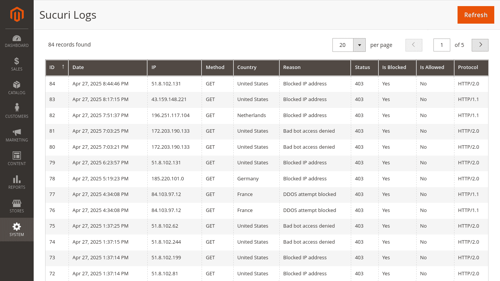

# Magento Sucuri

[](https://php.net/)
[](https://business.adobe.com/products/magento/magento-commerce.html)
[](https://github.com/Pixel-Open/magento-sucuri/releases)

## Presentation

The module adds Sucuri API features to Magento: cache management and logs.



## Requirements

- Magento >= 2.4.4
- PHP >= 8.0.0

## Installation

```
composer require pixelopen/magento-sucuri
```

## Configuration

Stores > Configuration > Service > Sucuri

**Multi-Website:** Use the scope config selector to fill API credentials for all websites.

## Clear the Website Firewall cache

### CLI

#### All websites

```shell
bin/magento sucuri:cache:flush
```

#### Specific website

```shell
bin/magento sucuri:cache:flush --website_id=1
```

### Admin UI

System > Cache Management > Additional Cache Management > Flush Sucuri Cache for X

## Display the audit log entries

System > Sucuri > Logs

**Multi-Website:** Use the scope selector to display requests per website.

## Refresh the log entries

### CLI

#### All websites

```shell
bin/magento sucuri:log:refresh
```

#### Specific website

```shell
bin/magento sucuri:log:refresh --website_id=1
```

### Admin UI

System > Sucuri > Logs > Refresh

**Multi-Website:** Use the scope selector before refreshing to a specific website.

### Automatically refresh logs every hour

Stores > Configuration > Service > Sucuri > Cron > Refresh Logs

### Log retention

Stores > Configuration > Service > Sucuri > Cron > Log retention (days)
